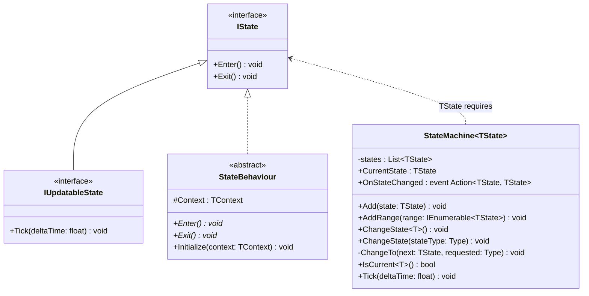



```mermaid

classDiagram
    direction BT

    %% Interfaces
    class IState {
        <<interface>>
        +Enter() void
        +Exit() void
    }

    class IUpdatableState {
        <<interface>>
        +Tick(deltaTime: float) void
    }
    IUpdatableState --|> IState

        class StateBehaviour {
        <<abstract>>
        +Enter()* void
        +Exit()* void
    }
    StateBehaviour ..|> IState
    

    class StateBehaviour~TContext~ {
        <<abstract>>
        #Context : TContext
        +Initialize(context: TContext) void
    }
    
    %% State Machine
    class StateMachine~TState~ {
        -states : List~TState~
        +CurrentState : TState
        +OnStateChanged : event Action~TState, TState~
        +Add(state: TState) void
        +AddRange(range: IEnumerable~TState~) void
        +ChangeState~T~() void
        +ChangeState(stateType: Type) void
        -ChangeTo(next: TState, requested: Type) void
        +IsCurrent~T~() bool
        +Tick(deltaTime: float) void
    }
    StateMachine~TState~ ..> IState : TState requires


```